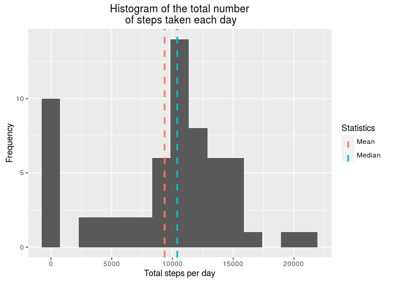

# Reproducible Research: Peer Assessment 1

From the description of the assignment:

*This assignment makes use of data from a personal activity monitoring device. This device collects data at 5 minute intervals through out the day. The data consists of two months of data from an anonymous individual collected during the months of October and November, 2012 and include the number of steps taken in 5 minute intervals each day.*

We refer directly to this [link](https://github.com/rdpeng/RepData_PeerAssessment1) for a description of all the tasks required for this assigment.

## Loading and preprocessing the data

In order to analyze and plot the data, we will need the following 2 libraries:


```r
library(dplyr)
library(ggplot2)
```

The data were downloaded as a zip file from the course [web site](https://d396qusza40orc.cloudfront.net/repdata%2Fdata%2Factivity.zip). After unzipping the file and 
setting the working directory so that it contains the unzipped file (named "activity.csv"), we read the data with:


```r
activity <- read.csv("activity.csv")
```

This stores in `activity` a data frame with 17568 rows and 3 columns, namely:

- **steps**: this gives the number of steps that the subject made in a 5-minute interval (missing values are coded as **NA**)
- **date**: this gives the date of the the measurement in the YYYY-MM-DD format (from October 1st to November 31st, 2012)
- **interval**: an identifier for the 5-minute interval in which measurement was taken

Using the command 


```r
unique(activity$interval)
```

we get that the field `interval` in `activity` is coded as follows:

- 0, 5, ... 55 for the first hour of the day
- 100, 105, ... 155 for the second hour
- and so on.

This is somehow not optimal for analyzing and plotting data; therefore we follow the following pre-processing procedure. We create a new variable `my.Time` by pasting hours (obtained as `floor()` of `activity$interval/100`) and minutes (obtained as rest of the division of `activity$interval` by 100). The resulting vector is a vector of characters, that we add to the columns of activity.


```r
time.vector <- paste(sprintf("%02d", floor(activity$interval/100)),
                           sprintf("%02d", activity$interval %% 100),
                           sep=":"
)

activity$time <- time.vector
```

Since we will need to plot some of the data from `activity$time`, it is more convenient to add also another column, called `complete.time`, storing a time in the POSIXct format. Since we don't provide a date for this, the date will be automatically set to be equal to the current date of the system (at compilation time). We will never use directly this date in all the rest of this analysis (but only its time component), so this is safe to do. In all the analysis below we will never need the complete date that we would obtain pasting together the values in `activity$time` and `activity$date`, so we are not going to add an additional column with these info.


```r
activity$complete.time <- as.POSIXct(activity$time, format = "%H:%M", tz = "GMT")
```

After this pre-processing, this is how the data frame `activity` looks like this:


```r
head(activity)
```

```
##   steps       date interval  time       complete.time
## 1    NA 2012-10-01        0 00:00 2016-10-12 00:00:00
## 2    NA 2012-10-01        5 00:05 2016-10-12 00:05:00
## 3    NA 2012-10-01       10 00:10 2016-10-12 00:10:00
## 4    NA 2012-10-01       15 00:15 2016-10-12 00:15:00
## 5    NA 2012-10-01       20 00:20 2016-10-12 00:20:00
## 6    NA 2012-10-01       25 00:25 2016-10-12 00:25:00
```

As we said above, the date 2016-10-12 is the system date at compilation time and is the same for all the values in the column `activity$complete.time`.

## What is mean total number of steps taken per day?

We start analysing the data by calculating the total number of steps taken per day (using the **dplyr** library): we first group the data in `activity` using the column `date`, then for each group we sum the values in the column `steps`. Since there are some NA values in `activity`, we need to set the parameter **na.rm = TRUE**.


```r
by.date <- group_by(activity, date)

summary.by.date <- summarise(by.date, sum.steps = sum(steps, na.rm = TRUE))
```

This gives a tibble with 61 rows (number of days in October and November), with the following head:


```r
head(summary.by.date)
```

```
## # A tibble: 6 × 2
##         date sum.steps
##       <fctr>     <int>
## 1 2012-10-01         0
## 2 2012-10-02       126
## 3 2012-10-03     11352
## 4 2012-10-04     12116
## 5 2012-10-05     13294
## 6 2012-10-06     15420
```

In the next lines we are going to plot these data in an histogram. We want to add to the histogram a pair of vertical lines with the mean and median of the total number of steps taken per day. In order to simplify the plotting instructions, we create a data frame with two columns, storing mean and median, as follows:


```r
statFrame = data.frame("Statistics" = c("Mean", "Median"),
                    "Value" = c(mean(summary.by.date$sum.steps),
                                median(summary.by.date$sum.steps)),
                    stringsAsFactors = FALSE)
```

This gives the following mean and median values:


```r
statFrame
```

```
##   Statistics    Value
## 1       Mean  9354.23
## 2     Median 10395.00
```

We use the **ggplot2** library for plotting the histogram of `summary.by.date`, together with the vertical lines for mean and median taken from `statFrame`. After experimenting a bit with the parameter `bin`, we decided to split the histogram in 15 bins, giving the following plot:


```r
ggplot(summary.by.date, aes(sum.steps)) +
  geom_histogram(bins = 15) +
  geom_vline(aes(xintercept = Value, color = Statistics),
             linetype = "dashed",
             size = 1,
             show.legend = TRUE,
             data = statFrame) +
  labs(title = "Histogram of the total number\n of steps taken each day",
       x = "Total steps per day",
       y = "Frequency")
```

<!-- -->

## What is the average daily activity pattern?

We now try to plot the number of steps taken per interval, averaged over the 61 days of activity. First of all, we group the data of `activity` using the values in the column `complete.time`, and we compute the mean of each group, saving the results in the tibble `summary.by.complete.time`.


```r
by.complete.time <- group_by(activity, complete.time)

summary.by.complete.time <- summarise(by.complete.time, mean.steps = mean(steps, na.rm = TRUE))
```

Such a tibble has 288 rows (total number of 5 minutes intervals in a day), and has the following head:


```r
head(summary.by.complete.time)
```

```
## # A tibble: 6 × 2
##         complete.time mean.steps
##                <dttm>      <dbl>
## 1 2016-10-12 00:00:00  1.7169811
## 2 2016-10-12 00:05:00  0.3396226
## 3 2016-10-12 00:10:00  0.1320755
## 4 2016-10-12 00:15:00  0.1509434
## 5 2016-10-12 00:20:00  0.0754717
## 6 2016-10-12 00:25:00  2.0943396
```

As above, the date component of the first column is equal to 2016-10-12 for all the 288 rows; we are only going to use the time component of the first column.

We use the library **ggplot2** in order to create a scatterplot of `summary.by.complete.time`


```r
ggplot(summary.by.complete.time, aes(complete.time, mean.steps)) +
  scale_x_datetime(date_labels = "%H",
                   limits = as.POSIXct(c("00:00","23:55"), format = "%H:%M", tz = "GMT") ) +
  geom_line(color = "blue") +
  labs(title = "Time series plot of the 5-minutes intervals\n and average number of steps taken",
       x = "Time of the day",
       y = "Average number of steps")
```

<!-- -->

Then we compute the 5-minute interval that, on average, contains the maximum number of steps.


```r
index.max <- which.max(summary.by.complete.time$mean.steps)

complete.time.max <- summary.by.complete.time$complete.time[index.max]

t.strip <- strptime(complete.time.max, "%Y-%m-%d %H:%M:%S")

interval.max <- paste(format(t.strip, "%H"),format(t.strip, "%M"), sep=":")
```

The interval with maximum average number of steps is therefore the 5-minute interval starting at


```r
interval.max
```

```
## [1] "08:35"
```

with an average number of steps equal to


```r
summary.by.complete.time$mean.steps[index.max]
```

```
## [1] 206.1698
```

This result is coherent with the information that we can obtain from the scatterplot above.

## Imputing missing values

As one can note from the head of `activity`, such a data frame contains some NA values in the column `steps`. The total number of NAs is given by


```r
na.Values <- sum(is.na(activity$steps))

na.Values
```

```
## [1] 2304
```

out of 17568 total rows of `activity`.

Until now we ignored the problem using **na.rm = TRUE** when we needed to compute mean, median and maximum. However, a better strategy could be to impute the missing data. Some (not exhaustive) alternatives can be:

- replacing an NA value for a 5-minute interval with the mean for that day
- or with the median for that day
- or with the mean for that 5-minute interval.

We choose the third alternative because the first 2 alternatives are not feasible: for example the first day (namely 2012-10-01) consits only of NA values in the column `steps`, as the following code proves:


```r
unique(activity[activity$date == "2012-10-01",]$steps)
```

```
## [1] NA
```

It is reasonable to assume that in this case the tracking device was switched off or not working, and we can assume that the subject behaved normally also during this day. So it is more reasonable to replace the missing data for each 5-minute interval of this day with the mean of that 5-minute interval.

Therefore we create a new data frame, `activity.Imputed`, where we replace the NA values of any given 5-minute interval with the mean of that 5-minute interval, as already saved in `summary.by.complete.time$mean.steps`


```r
activity.Imputed <- activity

for(i in 1:dim(activity.Imputed)[1]){
  if(is.na(activity.Imputed$steps[i]))
  {
    index <- which(summary.by.complete.time$complete.time == activity.Imputed$complete.time[i])
    activity.Imputed$steps[i] <- summary.by.complete.time$mean.steps[index]
  }
}
```

After the NA values are replaced, we want to compare the resulting histogram, mean and median with the ones already computed above with the original data frame `activity`. After grouping the data with


```r
by.date.Imputed <- group_by(activity.Imputed, date)

summary.by.date.Imputed <- summarise(by.date.Imputed, sum.steps = sum(steps, na.rm = TRUE))
```

we compute the mean and median of the imputed data frame:


```r
statFrame.Imputed = data.frame("Statistics" = c("Mean", "Median"),
                       "Value" = c(mean(summary.by.date.Imputed$sum.steps),
                                   median(summary.by.date.Imputed$sum.steps)),
                       stringsAsFactors = FALSE)

statFrame.Imputed
```

```
##   Statistics    Value
## 1       Mean 10766.19
## 2     Median 10766.19
```

So in the imputed case the median and mean are equal, and bigger of both mean and median of the non-imputed case (respectively equal to 9354.230 and 10395.000).

We plot an histogram of the imputed data using the same parameters that we used for the non-imputed case:


```r
ggplot(summary.by.date.Imputed, aes(sum.steps)) +
  geom_histogram(bins = 15) +
  geom_vline(aes(xintercept = Value, color = Statistics),
             linetype = c(1,2),
             size = 1,
             show.legend = TRUE,
             data = statFrame.Imputed) +
  labs(title = "Histogram of the total number\n of steps taken each day",
       x = "Total steps per day",
       y = "Frequency")
```

<!-- -->

## Are there differences in activity patterns between weekdays and weekends?

As a last part of our analysis, we want to verify if there are differences in the activity patterns between weekdays and weekends. For this, we are going to create a scatterplot comparing the average number of steps
taken per 5-minute interval across weekdays and weekends. We are going to use the imputed data frame (but a similar analysis can be performed also on the original data frame).

First of all, we create an auxiliary vector `week`, that stores the names of the weekdays associated to the dates in the column `activity.Imputed$date`.


```r
week <- weekdays(as.Date(activity.Imputed$date))
```

Then we rewrite each object of `week` with either the string 'weekday' or the string 'weekend', associated to the day of the week, and adds this vector as a factor column to the data frame `activity.Imputed`.


```r
week <- c("weekday", "weekend")[(week %in% c("Saturday","Sunday"))+1L]

activity.Imputed$week <- as.factor(week)
```

Using the **dplyr** library, we group `activity.Imputed` by weekdays and we summarize the colum `steps` using the function `mean()`. The result is the tibble called `summary.by.weekdays`.


```r
by.week <- group_by(activity.Imputed, week, complete.time)

summary.by.weekdays <- summarise(by.week, mean.average = mean(steps))
```

Lastly, we create a panel scatterplot out of `summary.by.weekdays` using almost the same parameters of the previous scatterplot. Differently from the previous scatterplot, this time we have to group (and color) using the factor in the colum `week`.


```r
ggplot(summary.by.weekdays, aes(complete.time, mean.average, group = week, colour = week)) +
  scale_x_datetime(date_labels = "%H",
                   limits = as.POSIXct(c("00:00","23:55"), format = "%H:%M", tz = "GMT") ) +
  geom_line() + facet_grid(week~.) +
  scale_colour_manual("",values = c("red", "blue")) +
  labs(title = "Time series plot of the 5-minutes intervals\n and average number of steps taken",
       x = "Time of the day",
       y = "Average number of steps")
```

<!-- -->

From this we can see that during the week the subject is waking up around 6am, and has a maximum activity around 8-9am, with some other peaks of activity until 8pm, almost completely going to zero around 10.30 pm. During the weekend the subject is waking up later, has some peaks of activity until midnight, and seems to move more than during the week. Probably during the week he/she is working in an office with limited need of walking except for meetings/lunch/commuting.  
